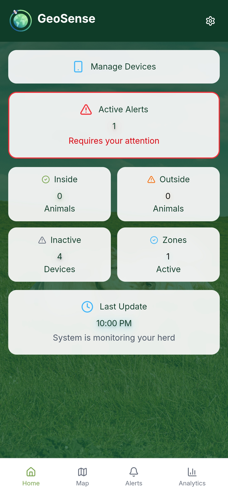

**Course:** Geoinformation in Society (WiSe 2025/26)

**Professors:** Prof. Dr. Christian Kray & Prof. Dr. Simge Oktay

**GitHub repositories:**  
- GeoSense (main app): <https://github.com/hectorvh/geosense>  
- GeoTracker (tracker app): <https://github.com/hectorvh/geotracker>

## Introduction

### Project and Goals

**GeoSense** is a mobile-first web application for **smart livestock monitoring and geofencing**. The project goal is to help livestock farmers and herd managers keep animals within safe areas, reduce time spent locating missing animals, and support faster responses when a device leaves a designated zone. The motivation is aligned with broader trends in “virtual fencing” and technology-assisted grazing management, which aim to improve animal management and welfare while reducing labor-intensive supervision @Gadzama2025; @Jero2025.

GeoSense combines three core elements:

- **Live positioning** from GPS-capable trackers (or a mobile tracker app)
- **Geofences (safe zones)** defined by users as polygons on a map
- **Alerts** when a device is outside the safe zone (and a foundation for further alerts such as inactivity or low battery)

A practical design constraint was to keep the system deployable with minimal operational overhead. Therefore, the solution is intentionally backend-light: it relies on Supabase (PostgreSQL + PostGIS, Auth, and Realtime) for storage, geospatial queries, security, and notifications without requiring an additional custom server.

### Target User Group and Tasks

The primary target users are **livestock farmers and herd managers** (operations of any scale). In practice, the user may be the farmer, a family member, or a worker responsible for daily herd supervision. The project supports the following tasks:

1. **Define safe areas** (pastures, paddocks, or seasonal grazing zones) by drawing polygons.
2. **Monitor herd status quickly** through a “glanceable” dashboard and map view.
3. **React to exceptions** by focusing attention on alerts (outside-zone) rather than continuously searching the map.
4. **Manage trackers and animals** by linking a tracker ID to an animal record, so alerts and status are interpretable.

::: {.persona-box}
**Summary**  
Agricultural workers operating in time-constrained, outdoor, and potentially low-connectivity environments.

The interface answers the question: “Which animal is out, where, and what should I do next?”.
:::

### Structure of Report

This report follows the required structure:

- **Design rationale**: how visualisation and interaction decisions were made for the target tasks.
- **Project description**: what was planned, what was implemented, and where the project currently stands.
- **Reflection/Discussion**: strengths, limitations, evaluation approach, and improvement opportunities.
- **Own contributions**: how the team collaborated and what I contributed across phases.
- **Use of genAI table**: disclosure of generative AI usage per task category.
- **References**: literature and policy sources informing the project context.

## Design

The design rationale is centered on a simple mental model: **“animals + zones + exceptions.”** In many real settings, the user is not continuously watching a screen; they need a system that gives confidence when things are normal and prioritizes attention only when something is wrong.

**Visualisation (map + dashboard):**

- **Dashboard as the default entry point:** Rather than opening directly on the map, GeoSense starts with a status overview. This supports a quick “health check” before the user invests effort into exploring the map.
- **Map as the spatial truth:** The map is the central artifact for the tasks “define safe zones” and “inspect exceptions.” Zones are polygons and devices are points—this matches how users understand spatial boundaries and positions.
- **State-driven encoding:** Marker appearance and alert counts are used to encode whether a device is inside or outside the safe zone, enabling a user to scan for problems quickly.
- **Basemap flexibility:** Satellite basemaps can be useful in rural contexts (recognizable fields and boundaries), while standard basemaps support orientation and navigation. The UI therefore supports switching basemaps, acknowledging differences in user preference and landscape type.

::: {.columns}
::: {.column}
{.mobile-img}
:::

::: {.column}
{.mobile-img}
:::
:::

::: {.columns}
::: {.column}
{.mobile-img}
:::

::: {.column}
{.mobile-img}
:::
:::

**Interaction (workflows and friction reduction):**

- **Progressive setup:** Setting up zones and linking devices can be unfamiliar. The workflow is structured so users can complete one step at a time (define zone → link device → confirm monitoring). The design avoids “everything at once” screens.
- **Clear create vs. edit separation:** Users often confuse editing actions on maps. GeoSense separates “Create Zone” from “Edit Zone” and supports explicit completion and cancellation actions to reduce accidental changes.
- **Low cognitive load defaults:** By default, the system emphasizes safe-zone monitoring and outside-zone alerts. Advanced analytics are secondary and can be developed as historical data accumulation grows.

A practical factor behind these choices is **uncertainty** in GPS-based tracking. Even when the tracked entity is an animal, positioning quality can vary due to device limitations, canopy cover, or signal conditions. Animal ecology work with GPS telemetry highlights both the power of location data and the importance of interpreting it carefully @Cagnacci2010. GeoSense therefore makes “freshness” visible (e.g., *Last update*) and treats the map as a decision aid rather than an unquestionable truth source.

### Link between User Group and Tasks

The rationale above links directly to user needs:

- **Fast monitoring:** The dashboard supports the user’s task to confirm “all good” in seconds.
- **Exception-driven response:** Alerts focus attention on the few events that require action.
- **Field usability:** Large tap targets, a small number of primary actions, and predictable navigation are aligned with mobile use outdoors.

A key design theme is also **privacy by design**. Location tracking is sensitive information (even for animals) because it can reveal farm routines, valuable assets, or sensitive operational patterns. Privacy perceptions in location-based services depend strongly on transparency, control, and contextual trust @Shevchenko2024; and location privacy research emphasizes minimizing exposure and preventing unnecessary tracking @Primault2018. GeoSense therefore incorporates explicit consent and “start/stop” control in the tracker component.

::: {.story-box}
**Privacy-by-design principle (applied)**  
Users need absolute control over when active tracking occurs, ensuring they only expose necessary location data and prevent the unintended broadcast of their farm's operational patterns.
:::

This is consistent with GDPR-style principles such as purpose limitation and data minimization (even when the tracked entity is not a person, farm-associated data can still be sensitive in practice) @GDPR2016; and aligns with governance discussions on animal location data ethics @Harper2023. In future iterations, privacy-preserving techniques (e.g., delaying or obfuscating precise coordinates, or preventing third-party geofence tracking) could be explored, as proposed in geofence privacy work such as PrivLoc @Tomic2014.



## Project Description

GeoSense consists of two connected applications:

- **GeoSense (main app):** user-facing dashboard, map, zones, alerts, and device management.
- **GeoTracker (tracker app):** a companion app that sends location updates and includes privacy controls.

Conceptually, the system follows an IoT-style herd monitoring pipeline similar to other low-cost livestock tracking systems, but adapted to a web-first stack @MarotoMolina2019 and extensible to low-power tracking technologies (e.g., LoRaWAN-based trackers) @Chedaod2020.

```mermaid
flowchart LR
  A[GeoTracker\n(tracker app)] -->|GPS updates| B[(Supabase\nPostgres + PostGIS)]
  C[GeoSense\n(web app)] -->|Auth + CRUD + Realtime| B
  B -->|alerts + live locations| C
```

**Core functionality**

- **Authentication & profiles:** account-based access with user-scoped data.
- **Zones:** polygon creation/editing stored as PostGIS geometry.
- **Device management:** linking a tracker ID to an animal record (name + optional metadata).
- **Monitoring:** map view showing zones and markers; basemap switching.
- **Alerts:** outside-zone alerts and a list view for reviewing exceptions.
- **Tracker privacy controls:** consent and start/stop tracking with status indicators.

::: {.columns}
::: {.column}
{.mobile-img}
:::

::: {.column}
{.mobile-img}
:::
:::

A design decision with high impact on reliability was to keep geofence checking close to the data model. Storing zones as geometries and evaluating point-in-polygon relationships in a spatial database reduces client-side inconsistencies. This also provides a clean basis for future features such as buffered zones, zone activation schedules, or multiple zone types (e.g., “no-go areas” vs. “safe grazing areas”).

### Planned and Realised Features

**What was planned**

- Single-backend architecture (Supabase) for simple deployment.
- Zones + live location markers on a map.
- Device linking with basic metadata.
- Alerts for: outside-zone, inactivity, low battery.
- A guided onboarding/tutorial for first-time setup.
- Simple analytics/summary for day-to-day monitoring.

**What was realised**

- Supabase-only backend with a stable data model and user-scoped access control.
- Polygon zone creation/editing and persistent storage in PostGIS.
- Live device markers and a dashboard that supports rapid status checks.
- Outside-zone alerts with a clear UI emphasis (dashboard + alerts view).
- A tracker app that requires explicit consent and provides start/stop control.
- Documentation and reproducible repositories for submission.

**Deferred / simplified aspects**

- Inactivity and low-battery alerts depend on consistent telemetry ingestion (battery/activity) and scheduled checks. The project establishes the alert pattern, but the full pipeline was not finalized.
- Advanced analytics require historical location traces. Literature suggests value in combining GPS with accelerometer data for behavior and anomalous event detection @Cabezas2022, but implementing and validating this robustly was beyond the scope of this seminar project.

### Github Repositories

- <https://github.com/hectorvh/geosense>  
- <https://github.com/hectorvh/geotracker>

## Discussion

### Final Product Evaluation

The final product meets its core aim: users can define safe zones, link trackers, monitor live positions, and detect outside-zone events through alerts. The dashboard reduces monitoring effort during normal operation, and the map provides spatial context when action is required.

From a “Geoinformation in Society” perspective, the project also illustrates that geospatial applications are socio-technical systems: the interface must support field workflows, the data must be trustworthy, and the system must respect privacy expectations. Location-based services research emphasizes that trust is strongly influenced by transparency and perceived control @Shevchenko2024, and privacy research highlights risks from continuous tracking if not carefully governed @Primault2018. GeoSense partially addresses this by making tracking explicit and by scoping access through authentication and RLS.

### Limitations

- **User testing with actual target users:** short usability sessions with farmers would validate setup time, terminology, and alert usefulness under real conditions.
- **Connectivity resilience:** offline-aware patterns (caching, retries, and clearer “stale data” warnings) would improve field reliability.
- **Accessibility:** a systematic review (contrast, touch targets, screen reader labels) would strengthen inclusivity, especially in sunlight/outdoor use.
- **Privacy governance:** retention settings, delete/export controls, and stronger minimization defaults (e.g., reduced precision modes) would further align with governance discussions @Harper2023 and minimization principles @GDPR2016.

### Strengths

- **Exception-first workflow:** the app emphasizes alerts and status instead of constant manual checking.
- **Clear zone interaction:** explicit completion reduces accidental edits and confusion on touch devices.
- **Geospatial consistency:** polygon-based logic supports coherent boundary checks across clients.
- **Deployable stack:** using Supabase kept the system easy to run and share for course submission.

### Evaluation Apprpoach

Evaluation was primarily formative and iterative:

- **Task walkthroughs** for the main flow (create zone → link device → see live marker → trigger alert).
- **Peer testing** to identify friction points and improve navigation clarity (e.g., what happens after finishing a zone).
- **Boundary checks** by moving points across polygon edges and validating alert transitions.

The main insight was that clarity and predictable navigation matter more than adding extra features. Feedback suggested that users benefit from explicit “next steps” after setup and from strong, visible status signals (last update, alert count).

For a future iteration, feedback could be used to improve:

- onboarding sequencing (fast first success),
- alert actionability (auto-focus on the alerting device on the map),
- severity levels and alert thresholds to prevent fatigue,
- resilience in intermittent connectivity conditions.



### Contributions

### Team Collaboration

We worked with a sprint-style process and regular presentations. Early phases benefited from collaborative discussion around problem framing, user tasks, and how to connect the project to the course themes (geoinformation, society, and trust). Several team members contributed to investigation, solution definition, testing sessions, documentation refinement, and presentation preparation.

A challenge was workload distribution. Engagement varied across the team: while some members contributed reliably to research, testing, documentation and presentation tasks, one member was mostly present during sprint presentations and contributed less to implementation-related work. As a result, the implementation and integration workload concentrated heavily on me, and I experienced a higher workload during development and polishing. In future teamwork, clearer role assignment (feature owners), intermediate milestones, and a shared Definition of Done would help distribute work more evenly and reduce bottlenecks.

### Own Contributions

My contributions focused primarily on implementation and end-to-end integration:

- translating requirements into concrete UI and data flows,
- implementing the dashboard, navigation, and mobile-first interactions,
- implementing zone creation/editing and map rendering of polygons/markers,
- integrating the backend data model, access control, and realtime updates,
- implementing outside-zone alerts and the alerts UI workflow,
- integrating tracker consent and reliable update mechanics.

Other team members contributed to literature/context, testing and validation feedback, documentation polishing, and presentation structure.

### Work Process

What worked well:
- building vertical slices early (end-to-end features),
- keeping spatial logic consistent and close to the data,
- iterating the UI based on feedback.

What did not work as well:
- uneven workload reduced time for deeper user evaluation,
- some planned features depend on richer telemetry (battery/activity),
- integration pressure increased near deadlines due to concentrated implementation work.



## Use of GenAI

::: {.ai-usage}
| Task | NO, I did not use genAI | YES, I did use genAI | genAI Tools |
|---|:---:|:---:|---|
| Better understand issues related to the research | **X** |  |  |
| Summarizing text from bibliography / resources |  | **X** | ChatGPT, Copilot and Gemini |
| Summarizing the method(s) used | **X** |  |  |
| Translating text | **X** |  |  |
| Grammar check | **X** |  |  |
| Paraphrase or rewriting text from other people / resources | **X** |  |  |
| Coding in R, Python, etc. |  | **X** | ChatGPT, Copilot |
| Get help on a software |  | **X** | ChatGPT, Copilot |
| Creating and editing images, maps, videos, etc. |  | **X** | ChatGPT, Copilot |
| Data analysis |  | **X** | ChatGPT, Copilot |
| Other (please, state the task(s) and tool(s)) |  | **X** | Audio generation — ElevenLabs |
:::



## References

::: {#refs}
:::
